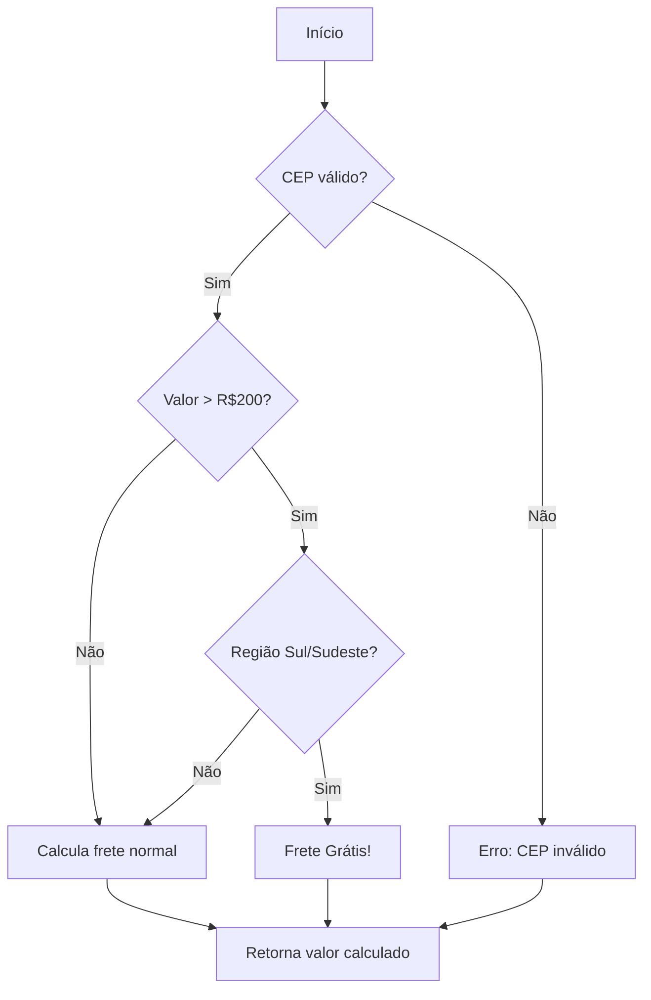

Claro! Aqui está um README.md completo e profissional para ensinar sua equipe a trabalhar com a documentação do projeto.

---

# 📖 Budd Documentação

Bem-vindo ao repositório de documentação Budd! Este guia vai te ensinar tudo o que você precisa saber para **usar**, **contribuir** e **manter** nossa documentação escrita com MkDocs.

## 📋 Índice

- [📖 Budd Documentação](#-budd-documentação)
  - [📋 Índice](#-índice)
  - [🎯 Visão Geral](#-visão-geral)
  - [🛠️ Tecnologias Utilizadas](#️-tecnologias-utilizadas)
  - [🚀 Primeiros Passos](#-primeiros-passos)
    - [Pré-requisitos](#pré-requisitos)
    - [Clonando o Repositório](#clonando-o-repositório)
    - [Configuração do Ambiente](#configuração-do-ambiente)
  - [👀 Como Visualizar a Documentação](#-como-visualizar-a-documentação)
  - [📁 Estrutura do Projeto](#-estrutura-do-projeto)
  - [✍️ Guia de Contribuição](#️-guia-de-contribuição)
    - [Criando uma Nova Página](#criando-uma-nova-página)
    - [Organizando Seções e Subseções](#organizando-seções-e-subseções)
    - [Usando Markdown](#usando-markdown)
      - [📝 Formatação Básica](#-formatação-básica)
      - [🔖 Listas](#-listas)
      - [🔗 Links e Imagens](#-links-e-imagens)
      - [⚠️ Advertências (Admonitions)](#️-advertências-admonitions)
      - [📦 Blocos de Código com Destaque](#-blocos-de-código-com-destaque)
      - [✅ Listas de Tarefas](#-listas-de-tarefas)
    - [Adicionando Imagens](#adicionando-imagens)
  - [💡 Exemplos de Casos de Uso](#-exemplos-de-casos-de-uso)
    - [Exemplo 1: Documentando uma API](#exemplo-1-documentando-uma-api)
    - [Exemplo de Resposta (200 OK)](#exemplo-de-resposta-200-ok)
    - [Códigos de Erro](#códigos-de-erro)
  - [Passo 2: Configure as Variáveis de Ambiente](#passo-2-configure-as-variáveis-de-ambiente)
  - [Passo 3: Suba os Serviços com Docker](#passo-3-suba-os-serviços-com-docker)
  - [Passo 4: Execute as Migrações](#passo-4-execute-as-migrações)
  - [Passo 5: Teste a Configuração](#passo-5-teste-a-configuração)
  - [Exemplos Práticos](#exemplos-práticos)
    - [Como adicionar um novo plugin?](#como-adicionar-um-novo-plugin)
    - [A documentação não atualiza no navegador](#a-documentação-não-atualiza-no-navegador)
    - [O menu de navegação não mostra minha nova página](#o-menu-de-navegação-não-mostra-minha-nova-página)
  - [🤝 Contribuidores](#-contribuidores)

---

## 🎯 Visão Geral

Nossa documentação é construída com **[MkDocs](https://www.mkdocs.org/)** e utiliza o tema **[Material for MkDocs](https://squidfunk.github.io/mkdocs-material/)** para garantir uma experiência de leitura agradável, organizada e profissional.

**Objetivos:**
- Centralizar todo conhecimento técnico do projeto
- Facilitar a onboarding de novos desenvolvedores
- Manter um histórico claro de decisões e funcionalidades
- Servir como referência rápida para APIs, fluxos e regras de negócio

## 🛠️ Tecnologias Utilizadas

- **MkDocs** - Gerador de site estático
- **Material for MkDocs** - Tema moderno e responsivo
- **Python 3.7+** - Linguagem base do MkDocs
- **Markdown** - Formatação do conteúdo
- **Plugins**:
  - `mkdocs-awesome-pages-plugin` - Organização avançada de navegação
  - `mkdocs-minify-plugin` - Otimização dos arquivos
  - `pymdown-extensions` - Extensões avançadas de Markdown

## 🚀 Primeiros Passos

### Pré-requisitos

- **Git** instalado
- **Python 3.7 ou superior** instalado
- **pip** (gerenciador de pacotes Python)
- Um editor de texto (recomendamos VS Code)

### Clonando o Repositório

```bash
# Clone o repositório
git clone https://github.com/brunofullstack/budd-docs.git

# Entre na pasta do projeto
cd nome-do-projeto-docs

# Crie um branch para sua contribuição (se aplicável)
git checkout -b feature/nome-da-sua-documentacao
```

### Configuração do Ambiente

1. **Crie um ambiente virtual Python (recomendado):**

```bash
# Criar ambiente virtual
python -m venv venv

# Ativar no Linux/Mac
source venv/bin/activate

# Ativar no Windows
venv\Scripts\activate
```

2. **Instale as dependências:**

```bash
pip install -r requirements.txt
```

Se não existir um arquivo `requirements.txt`, instale manualmente:

```bash
pip install mkdocs mkdocs-material mkdocs-awesome-pages-plugin mkdocs-minify-plugin pymdown-extensions
```

## 👀 Como Visualizar a Documentação

Para visualizar a documentação localmente enquanto edita:

```bash
# Iniciar servidor de desenvolvimento
mkdocs serve
```

Acesse `http://127.0.0.1:8000` no seu navegador. O servidor atualiza automaticamente quando você salva alterações.

**Para gerar uma versão estática:**

```bash
# Gerar site estático na pasta 'site/'
mkdocs build
```

## 📁 Estrutura do Projeto

```
.
├── docs/                       # 📚 Arquivos da documentação
│   ├── index.md                # Página inicial
│   ├── guia/                   # Seção de guias
│   │   ├── .pages              # Configuração da seção
│   │   ├── instalacao.md       # Guia de instalação
│   │   └── configuracao.md     # Guia de configuração
│   ├── api/                     # Documentação da API
│   │   ├── autenticacao.md
│   │   └── endpoints/
│   │       ├── usuarios.md
│   │       └── produtos.md
│   ├── img/                     # Imagens e assets
│   │   ├── diagrama-fluxo.png
│   │   └── logo.png
│   └── faq.md                    # Perguntas frequentes
├── mkdocs.yml                    # ⚙️ Configuração principal
├── requirements.txt              # Dependências Python
└── README.md                     # Este arquivo
```

## ✍️ Guia de Contribuição

### Criando uma Nova Página

1. **Navegue até a pasta `docs/`**
2. **Crie um novo arquivo `.md`** (ex: `minha-nova-pagina.md`)
3. **Adicione conteúdo básico:**

```markdown
# Título da Minha Nova Página

## Introdução
Escreva aqui uma breve introdução sobre o assunto.

## Como Funciona
Explique detalhadamente o funcionamento.
```

4. **Adicione ao menu de navegação** editando o arquivo `mkdocs.yml`:

```yaml
nav:
  - Início: index.md
  - Minha Nova Página: minha-nova-pagina.md  # ← Adicione esta linha
```

### Organizando Seções e Subseções

**Método 1: Configurando no `mkdocs.yml`**

```yaml
nav:
  - Início: index.md
  - Guia do Usuário:
    - Instalação: guia/instalacao.md
    - Configuração: guia/configuracao.md
    - Tópicos Avançados:
        - CLI: guia/avancado/cli.md
        - API: guia/avancado/api.md
```

**Método 2: Usando arquivos `.pages` (recomendado para projetos grandes)**

Crie um arquivo `.pages` dentro da pasta:

```yaml
# docs/guia/.pages
title: Guia do Usuário
nav:
  - instalacao.md
  - configuracao.md
  - Avancado: avancado
```

### Usando Markdown

Nossa documentação suporta Markdown estendido com vários recursos úteis:

#### 📝 Formatação Básica

```markdown
# Título 1
## Título 2
### Título 3

**Negrito**
*Itálico*
~~Riscado~~
`código inline`
```

#### 🔖 Listas

```markdown
- Item 1
- Item 2
  - Subitem 2.1
  - Subitem 2.2

1. Primeiro
2. Segundo
```

#### 🔗 Links e Imagens

```markdown
[Link para Google](https://www.google.com)


```

#### ⚠️ Advertências (Admonitions)

```markdown
!!! note "Nota Importante"
    Este é um bloco de nota. Use para informações importantes.

!!! tip "Dica"
    Aqui vai uma dica útil para o desenvolvedor.

!!! warning "Atenção"
    Cuidado com esta configuração em produção!

!!! danger "Perigo"
    Isso pode causar perda de dados!
```

#### 📦 Blocos de Código com Destaque

```markdown
```python
def hello_world():
    print("Olá, mundo!")
```
```

#### 📑 Abas de Conteúdo

```markdown
=== "Python"
    ```python
    print("Exemplo em Python")
    ```

=== "JavaScript"
    ```javascript
    console.log("Exemplo em JS");
    ```
```

#### ✅ Listas de Tarefas

```markdown
- [x] Tarefa concluída
- [ ] Tarefa pendente
```

### Adicionando Imagens

1. **Coloque a imagem na pasta `docs/img/`**
2. **Referencie no Markdown:**

```markdown

```

## 💡 Exemplos de Casos de Uso

### Exemplo 1: Documentando uma API

**Arquivo: `docs/api/endpoints/usuarios.md`**

```markdown
# Endpoint: Usuários

## Listar Usuários `GET /api/usuarios`

Retorna uma lista paginada de usuários cadastrados.

### Parâmetros de Consulta

| Parâmetro | Tipo     | Descrição                    |
|-----------|----------|------------------------------|
| `page`    | integer  | Número da página (padrão: 1) |
| `limit`   | integer  | Itens por página (padrão: 10)|
| `search`  | string   | Busca por nome ou email      |

### Exemplo de Requisição

```bash
curl -X GET "https://api.exemplo.com/usuarios?page=1&limit=5" \
  -H "Authorization: Bearer {seu_token}"
```

### Exemplo de Resposta (200 OK)

```json
{
  "data": [
    {
      "id": 1,
      "nome": "João Silva",
      "email": "joao@email.com"
    }
  ],
  "pagination": {
    "page": 1,
    "total_pages": 10,
    "total_items": 100
  }
}
```

### Códigos de Erro

| Código | Descrição                  |
|--------|----------------------------|
| 401    | Token inválido ou expirado |
| 403    | Sem permissão de acesso    |
| 404    | Usuário não encontrado     |
```

### Exemplo 2: Criando um Tutorial Passo a Passo

**Arquivo: `docs/guias/configurar-ambiente-dev.md`**

```markdown
# Configurando Ambiente de Desenvolvimento

!!! tip "Pré-requisitos"
    - Docker instalado
    - Node.js 18+
    - Acesso ao repositório privado de pacotes

## Passo 1: Clone os Repositórios

```bash
git clone https://github.com/empresa/backend.git
git clone https://github.com/empresa/frontend.git
```

## Passo 2: Configure as Variáveis de Ambiente

Crie um arquivo `.env` na raiz do backend:

```env
DATABASE_URL=postgresql://localhost:5432/app
REDIS_URL=redis://localhost:6379
JWT_SECRET=sua_chave_secreta
```

## Passo 3: Suba os Serviços com Docker

```bash
cd backend
docker-compose up -d postgres redis
```

## Passo 4: Execute as Migrações

```bash
npm run migrate
npm run seed
```

## Passo 5: Teste a Configuração

```bash
npm run test:setup
```

=== "Se aparecer ✅ Sucesso"
    Parabéns! Seu ambiente está configurado!

=== "Se aparecer ❌ Erro"
    Verifique os logs com `docker-compose logs` e consulte nossa [seção de troubleshooting](../faq.md#erros-comuns).
```

### Exemplo 3: Documentando uma Regra de Negócio

**Arquivo: `docs/regras/calculo-frete.md`**

```markdown
# Regra de Negócio: Cálculo de Frete

## Visão Geral

O cálculo de frete varia conforme:
- Região de entrega (CEP)
- Peso do produto
- Valor do pedido (para frete grátis)

## Fórmula de Cálculo

```
frete = (peso * taxa_por_kg) * multiplicador_regiao
```

### Multiplicadores por Região

| Região      | Multiplicador |
|-------------|---------------|
| Sudeste     | 1.0           |
| Sul         | 1.2           |
| Centro-Oeste| 1.5           |
| Nordeste    | 1.8           |
| Norte       | 2.2           |

## Frete Grátis

!!! success "Condições para Frete Grátis"
    - Pedidos acima de R$ 200,00
    - Regiões Sudeste e Sul
    - Peso máximo de 5kg

## Fluxo de Decisão



## Exemplos Práticos

| Pedido                | Região  | Peso | Valor | Frete Calculado |
|-----------------------|---------|------|-------|-----------------|
| Smartphone            | Sudeste | 0.5kg| R$1500| R$ 0,00 (grátis)|
| Livros                | Nordeste| 2kg  | R$80  | R$ 28,80        |
| Móvel                 | Norte   | 20kg | R$500 | R$ 110,00       |
```

## ✅ Boas Práticas

1. **Mantenha a linguagem clara e objetiva** - Evite jargões desnecessários
2. **Sempre inclua exemplos** - Exemplos valem mais que mil palavras
3. **Atualize a documentação junto com o código** - Documentação desatualizada é pior que nenhuma
4. **Use nomes descritivos para arquivos** - `configurar-ambiente.md` é melhor que `doc1.md`
5. **Quebre documentos longos** - Se um arquivo tem mais de 500 linhas, considere dividir
6. **Revise a ortografia** - Use ferramentas como Grammarly ou LanguageTool

## ❓ Dúvidas Frequentes

### Como faço para deploy da documentação?

```bash
# Build do site estático
mkdocs build

# Deploy para GitHub Pages (se configurado)
mkdocs gh-deploy
```

### Como adicionar um novo plugin?

1. Instale o plugin: `pip install nome-do-plugin`
2. Adicione no `requirements.txt`
3. Configure no `mkdocs.yml`:
   ```yaml
   plugins:
     - search
     - nome-do-plugin
   ```

### A documentação não atualiza no navegador

- Verifique se o `mkdocs serve` está rodando
- Tente limpar o cache do navegador (Ctrl + F5)
- Verifique se o arquivo foi salvo

### O menu de navegação não mostra minha nova página

- Confirme se o arquivo existe na pasta `docs/`
- Verifique a sintaxe no `mkdocs.yml` (indentação é importante!)
- Reinicie o servidor `mkdocs serve`

---

## 🤝 Contribuidores

Este documento é mantido pela equipe de tecnologia. Para sugerir melhorias, abra uma issue ou pull request no repositório.

**Happy documenting!** 📚✨

---

*Última atualização: Março 2026*